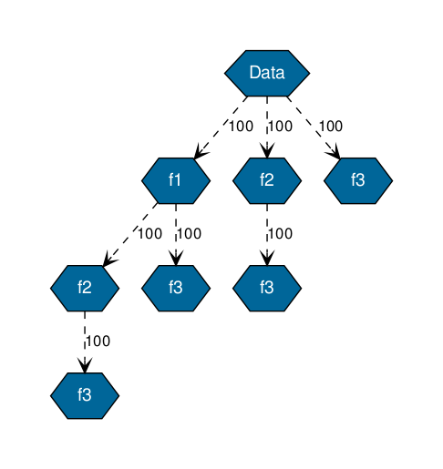

# FeatureAnalysis
Analysis of the absent data in order to select the subset of features shared by the most patients

## Goal
This tool allows to select the subset of features containing the less missing values. Additional functionnalities are available in order to merge features (in medical data, it is usually the case that some features can be obtained from other, so during the analysis it can be interesting to merge such feature)

## Dependencies
Executed with python2 and 3 with pandas and graphviz libraries for visualization

## Project

### Analysis
Contains the code of an eclat algorithm and the functions necessary for displaying the graph.

### Examples
A small example is used on a generated dataset.  
It will produce multiple images given the chosen option:  

